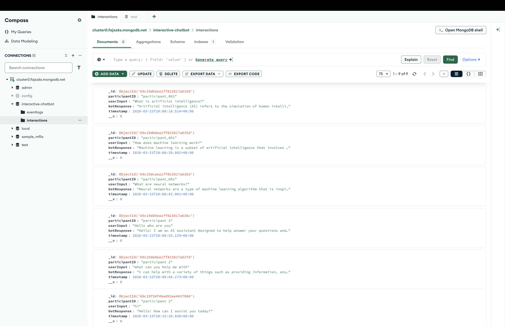
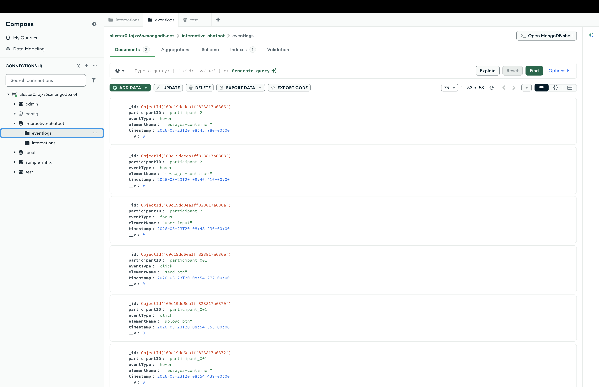
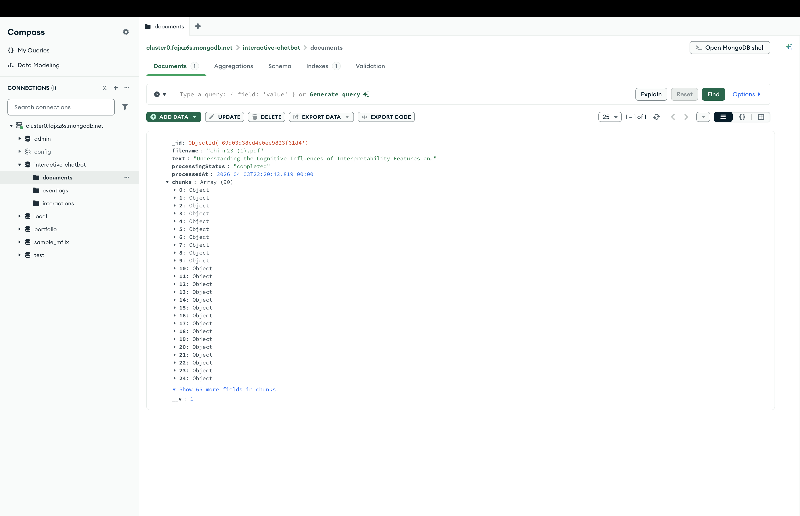
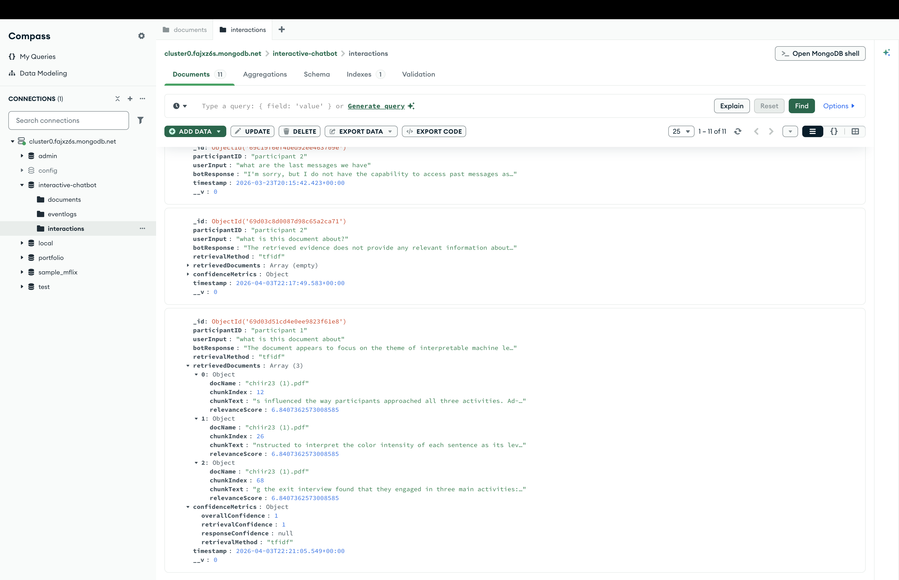

# Interactive Chatbot

Part 4 of the chatbot project extends the app into a Retrieval-Augmented Generation (RAG) system built with Node.js, Express, MongoDB, and OpenAI.

The app supports:

- uploading TXT and PDF documents from the left panel
- processing documents into chunks and storing them in MongoDB
- generating embeddings for semantic retrieval
- retrieving evidence with either `semantic` or `tfidf`
- grounding chatbot responses in retrieved document chunks
- displaying retrieved evidence and confidence metrics in the chat UI
- storing interactions, retrieval evidence, confidence data, and event logs in MongoDB

## Tech Stack

- Node.js
- Express
- MongoDB with Mongoose
- OpenAI API
- Vanilla JavaScript
- HTML/CSS

## Project Structure

```text
Interactive-Chatbot/
├── models/
│   ├── Document.js
│   ├── EventLog.js
│   └── Interaction.js
├── public/
│   ├── chat.html
│   ├── home.js
│   ├── index.html
│   ├── script.js
│   └── style.css
├── screenshots/
├── services/
│   ├── confidenceCalculator.js
│   ├── documentProcessor.js
│   ├── embeddingService.js
│   └── retrievalService.js
├── utils/
│   ├── textUtils.js
│   └── vectorUtils.js
├── server.js
├── package.json
└── README.md
```

## Setup

### Prerequisites

- Node.js 18+ recommended
- npm
- a MongoDB connection string
- an OpenAI API key

### Environment Variables

Create a `.env` file with:

```env
MONGO_URI=your_mongodb_connection_string
OPENAI_API_KEY=your_openai_api_key
```

### Install Dependencies

```bash
npm install
```

### Run the App

For normal use:

```bash
npm start
```

For development:

```bash
npm run dev
```

The server runs on:

```text
http://localhost:3000
```

## Core Routes

### `GET /documents`

Returns the uploaded documents stored in MongoDB.

### `POST /upload-document`

Accepts a TXT or PDF file, extracts text, chunks it, generates embeddings, stores the processed document, and rebuilds the TF-IDF index.

### `POST /chat`

Accepts:

```json
{
  "participantID": "user-1",
  "message": "What does the uploaded document say?",
  "retrievalMethod": "semantic"
}
```

Returns a grounded chatbot response plus retrieved evidence and confidence metrics.

### `POST /history`

Returns the saved interaction history for a participant.

### `POST /log-event`

Stores UI interaction events such as clicks, focus, and hover events.

## Part 4 Features

### Document Upload and Storage

- uploaded documents are stored in the `Document` collection
- processed chunks and chunk embeddings are saved for retrieval

### Retrieval Methods

- `semantic` uses embeddings
- `tfidf` uses keyword-based retrieval

### RAG Chat

- each prompt retrieves top relevant chunks
- retrieved evidence is added to the OpenAI prompt before response generation

### Explainability and Confidence

- the UI displays retrieved document chunks and relevance scores
- the UI displays confidence metrics derived from the retrieved evidence
- interactions store retrieval evidence and confidence fields in MongoDB

## MongoDB Screenshots

### Interactions Collection


### Event Logs Collection


### Part 4 Document Collection


### Part 4 Interaction with Retrieval Evidence and Confidence


## Scripts

- `npm start` runs the Express server
- `npm run dev` runs the server with `nodemon`
